# Unified System Workflow: Memory Bank + Task Magic

This document describes the complete operational workflow for the unified Memory Bank + Task Magic system, covering AI agent session management, task operations, and continuous learning patterns.

## System Overview

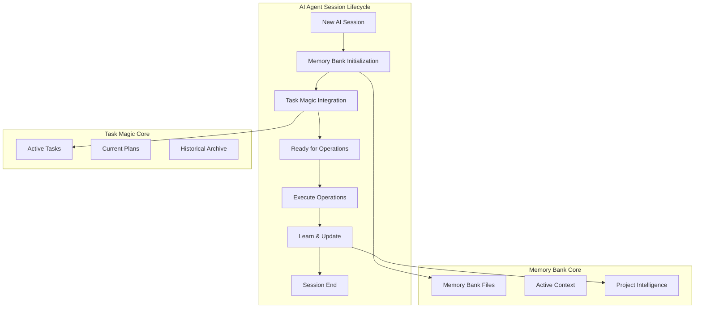

## Phase 1: Session Initialization

### 1.1 Auto-Detection Protocol (MANDATORY FIRST STEP)

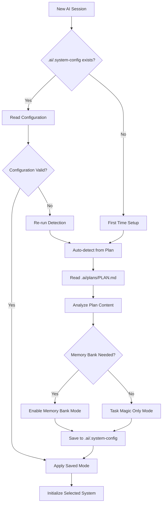

### 1.2 Memory Bank Initialization (When Enabled)

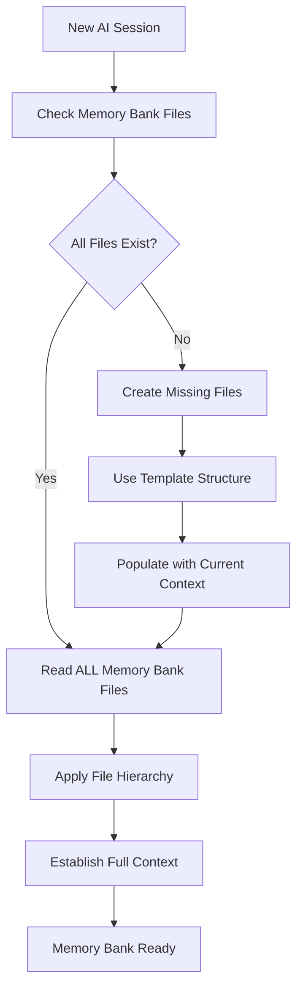

**Required Actions:**
1. **Read `memory-bank/projectbrief.md`** - Foundation understanding
2. **Read `memory-bank/productContext.md`** - Product goals and problems
3. **Read `memory-bank/systemPatterns.md`** - Architecture and patterns  
4. **Read `memory-bank/techContext.md`** - Technical environment
5. **Read `memory-bank/activeContext.md`** - Current work focus
6. **Read `memory-bank/progress.md`** - Current status and progress

### 1.3 Task Magic Integration (Always Active)

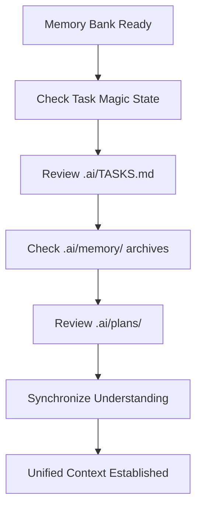

## Phase 2: Operation Modes

### 2.0 Mode Detection and Enforcement

**MANDATORY MODE CHECK**: Before processing ANY user request, determine the appropriate mode:

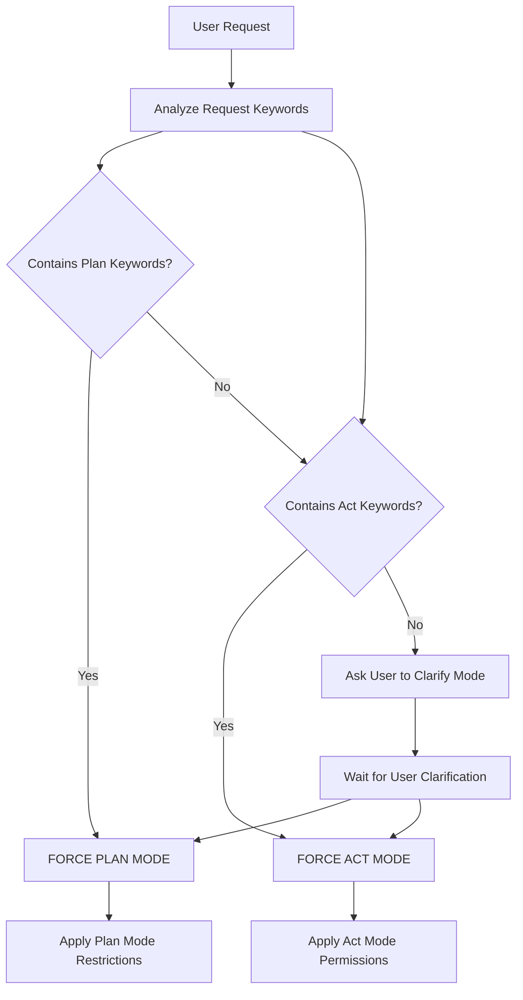

**Detection Keywords:**

**PLAN MODE Triggers** (Prevents code generation):
- plan, planning, strategy, design, architecture
- requirements, specification, analyze, breakdown
- structure, PRD, document, outline, roadmap
- "what should we build", "how should this work"
- "create a plan", "design the system"

**ACT MODE Triggers** (Allows code generation):
- implement, code, build, create files, develop
- write code, program, execute, run, install
- fix bugs, debug, patch, deploy, setup
- "start coding", "create the files", "implement this"

**Ambiguous Requests**: If unclear, ASK THE USER:
> "Would you like me to create a plan/design (Plan Mode) or start implementing code (Act Mode)?"

### 2.1 Plan Mode Workflow

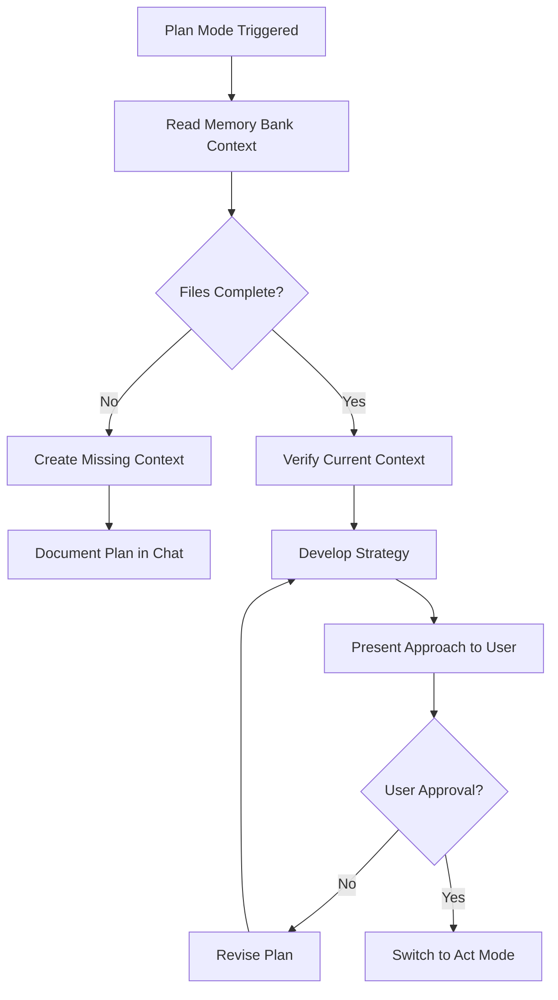

**CRITICAL PLAN MODE RESTRICTIONS:**

🚫 **PLAN MODE MUST NEVER:**
- Generate ANY code files (.py, .js, .ts, .html, .css, etc.)
- Create implementation files
- Write actual source code
- Execute code-related commands
- Install dependencies or packages
- Run build/compile commands

✅ **PLAN MODE ONLY CREATES:**
- Planning documents (.md files in .ai/plans/)
- Architecture diagrams (Mermaid)
- PRD documents (Product Requirements Documents)
- Technical specification documents
- Task breakdown structures
- Design documentation
- Analysis reports

**Plan Mode Detection Rules:**
```
PLAN MODE is triggered when user requests contain:
- "plan", "planning", "strategy", "design"
- "architecture", "requirements", "specification"
- "analyze", "breakdown", "structure"
- "PRD", "document", "outline"
- ANY request for planning without explicit "implement" or "code"

ACT MODE is triggered when user requests contain:
- "implement", "code", "build", "create files"
- "write code", "develop", "program"
- "execute", "run", "install"
- "fix bugs", "debug", "patch"
- Explicit request to create .py/.js/.ts files
```

**Plan Mode Output Rules:**
1. **Documentation Only**: Create comprehensive planning documents
2. **No Code Generation**: Absolutely no source code file creation
3. **Strategy Focus**: Focus on high-level architecture and approach
4. **Task Preparation**: Prepare detailed task breakdown for Act Mode
5. **Context Building**: Ensure all necessary context is documented

### 2.2 Act Mode Workflow

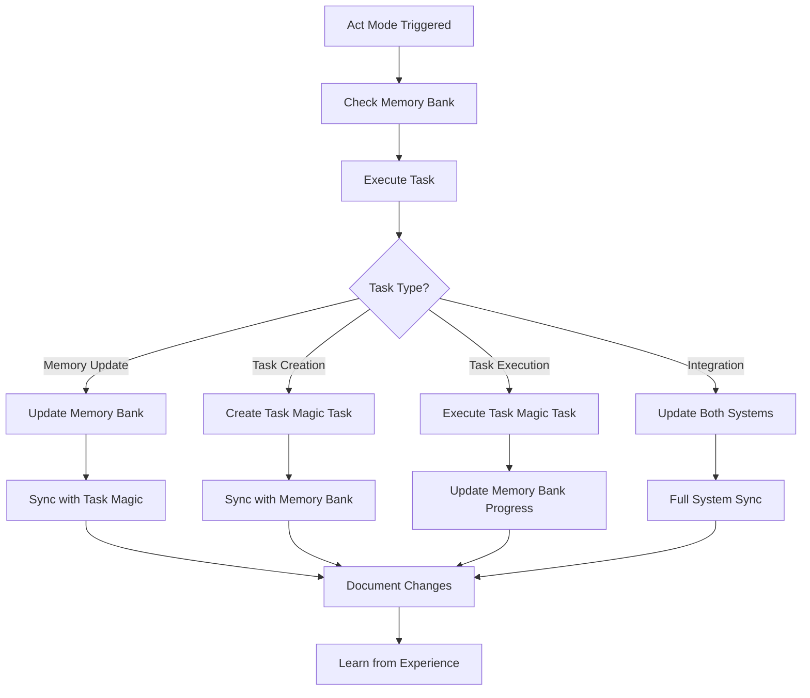

**CRITICAL ACT MODE PERMISSIONS:**

✅ **ACT MODE CAN:**
- Generate and create source code files (.py, .js, .ts, etc.)
- Implement actual functionality
- Install dependencies and packages
- Run build/compile/test commands
- Execute code and scripts
- Create project structure and directories
- Apply patches and fixes
- Integrate with external APIs
- Set up development environment

🚫 **ACT MODE SHOULD NOT:**
- Create new planning documents without explicit request
- Modify global project strategy without user confirmation
- Make architectural decisions without referring to plans
- Skip task dependency checks
- Ignore established patterns from Memory Bank

**Act Mode Requirements:**
1. **Plan Reference**: Always refer to existing plans before implementation
2. **Task-Based**: Execute specific tasks from .ai/TASKS.md
3. **Memory Bank Sync**: Update progress and context after significant changes
4. **Quality Assurance**: Ensure code quality and testing
5. **Documentation**: Update technical documentation as needed

**Mode Transition Rules:**
- **Plan → Act**: Only after user approves the plan and requests implementation
- **Act → Plan**: When encountering undefined requirements or architectural questions
- **Auto-detection**: Based on user request keywords (see Plan Mode Detection Rules above)

## Phase 3: Task Magic Operations

### 3.1 Task Creation and Management

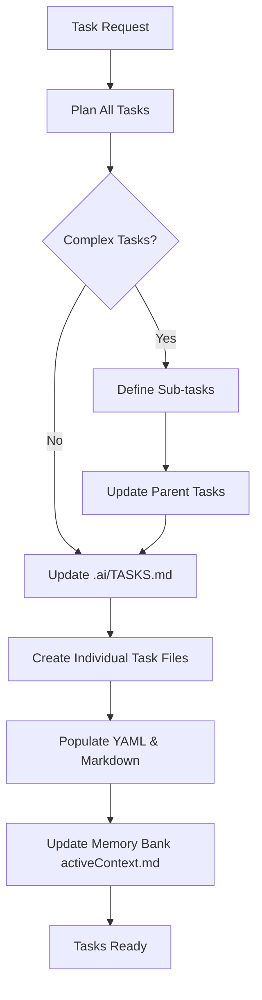

### 3.2 Task Execution Workflow

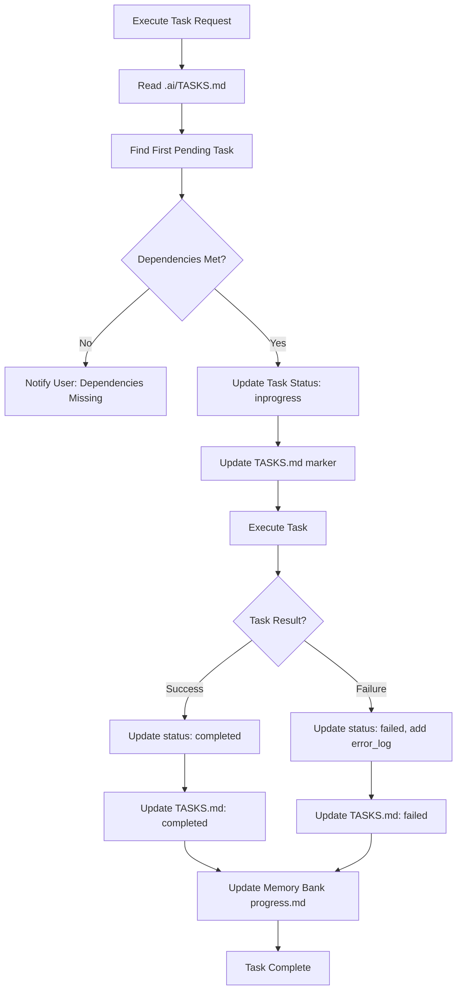

### 3.3 Task Archival Workflow

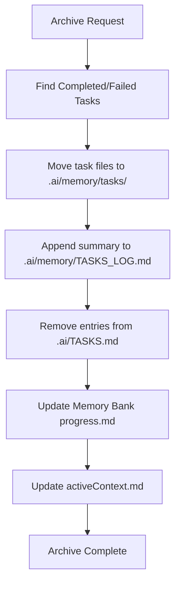

## Phase 4: Memory Bank Update Workflows

### 4.1 Automatic Update Triggers

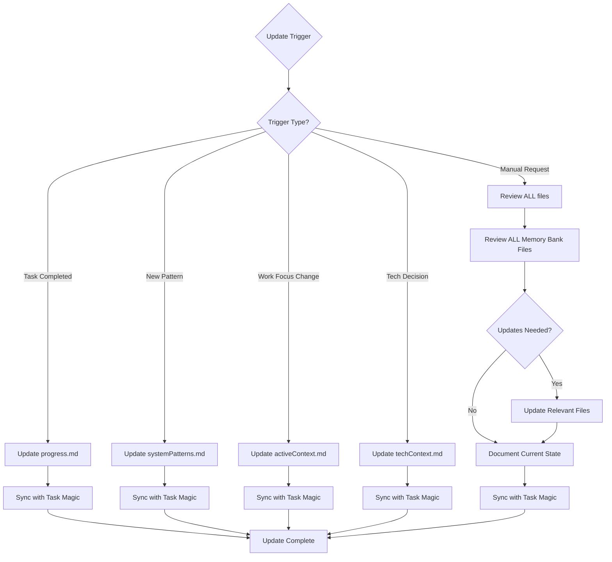

### 4.2 Manual Memory Bank Update Process

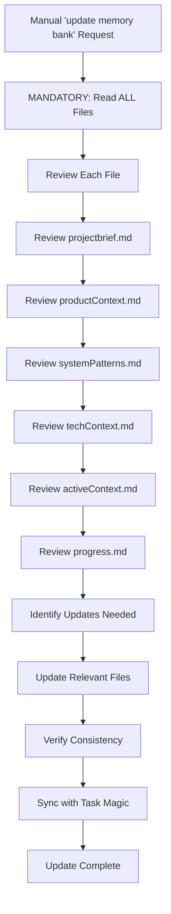

## Phase 5: Project Intelligence & Learning

### 5.1 Pattern Discovery and Learning

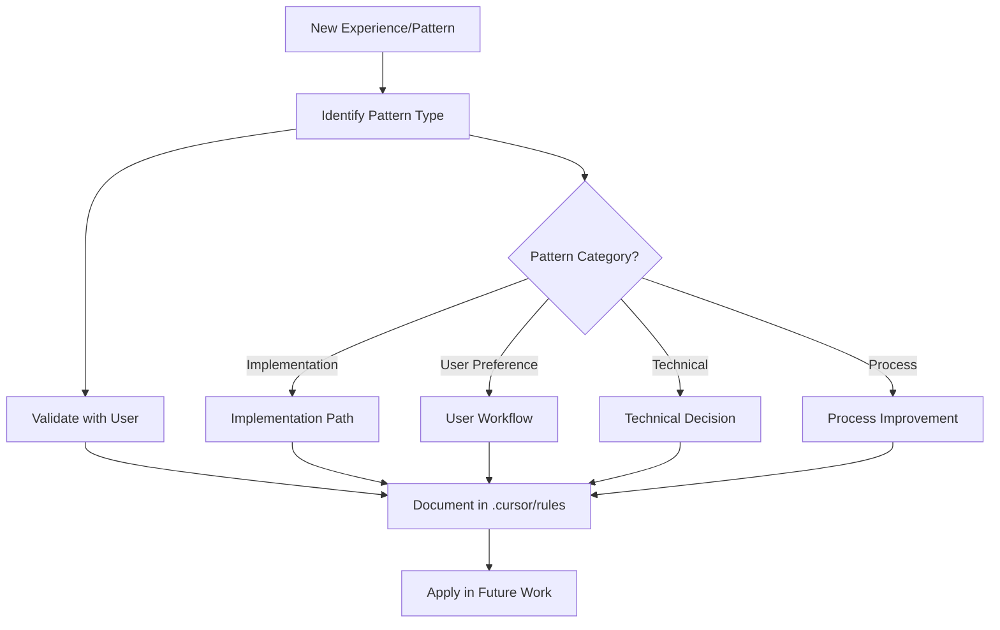

### 5.2 Continuous Improvement Cycle

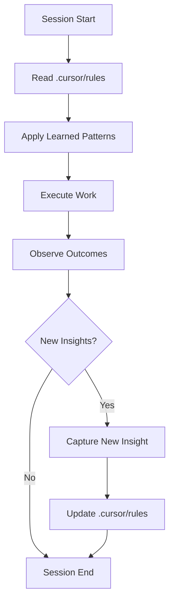

## Phase 6: Error Handling and Recovery

### 6.1 System State Recovery

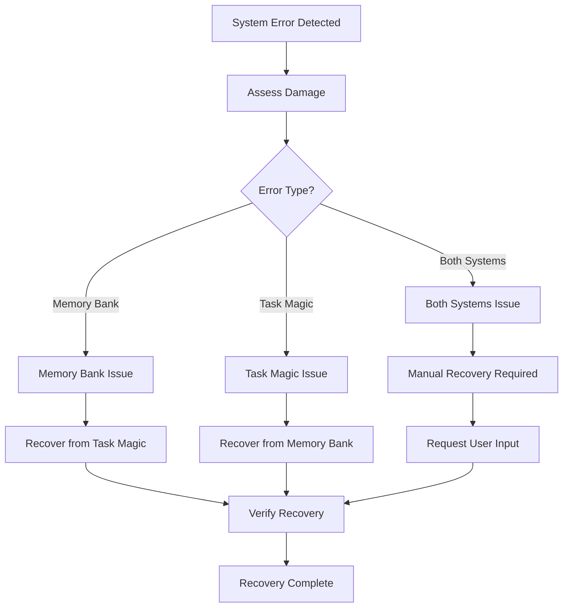

### 6.2 Data Consistency Checks

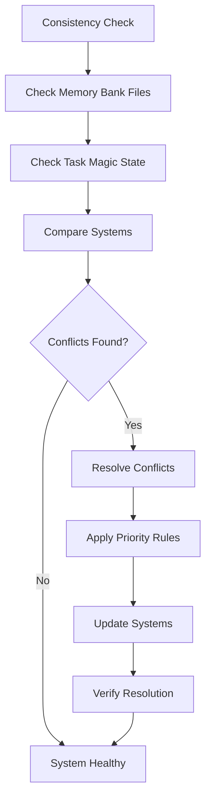

## System Responsibility Matrix

### Clear Separation of Concerns

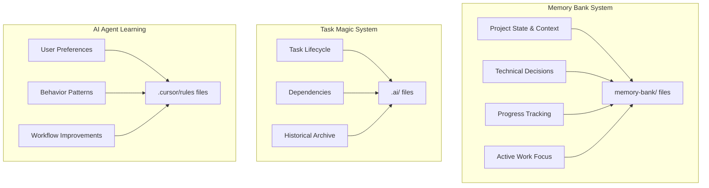

### Update Responsibility Rules

| System | Updates | Never Updates |
|--------|---------|---------------|
| **Memory Bank** | Project context, progress, technical decisions | .cursor/rules, task files |
| **Task Magic** | Task status, dependencies, archives | Memory Bank files, .cursor/rules |
| **AI Agent** | .cursor/rules based on experience | Memory Bank content, task details |

### Data Flow Boundaries

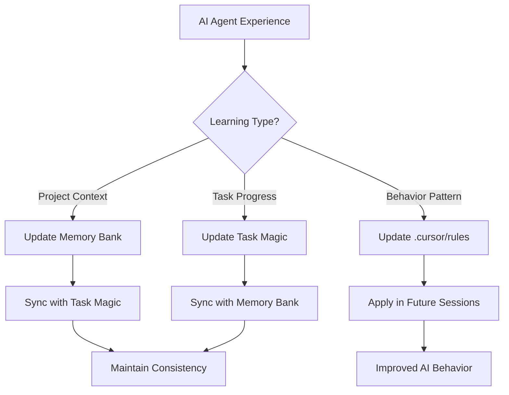

## Key Operational Principles

### 1. Mode-First Approach
- **ALWAYS determine Plan vs Act mode FIRST** before any action
- **Strictly enforce mode restrictions** - no exceptions
- **Plan Mode = Documentation Only, Act Mode = Implementation Only**

### 2. Memory-First Approach
- **Always read Memory Bank files first** at session start
- **Memory Bank drives all operations** with Task Magic providing support
- **Context preservation** is critical for effective AI operation

### 3. Unified Command Processing
- **Single entry point** through Memory Bank system
- **Automatic synchronization** between systems
- **Consistent state** maintained across all operations

### 4. Continuous Learning
- **Pattern recognition** and documentation in .cursor/rules
- **Project intelligence** accumulation over time
- **Adaptive behavior** based on learned patterns

### 5. Quality Assurance
- **Mandatory file reviews** for critical operations
- **Consistency checks** between systems
- **Error recovery** mechanisms built-in

## CRITICAL MODE ENFORCEMENT SUMMARY

🚨 **NEVER VIOLATE THESE RULES:**

**PLAN MODE** = Documentation & Design Only:
- ✅ Create .md files in .ai/plans/
- ✅ Generate diagrams and specifications  
- ✅ Write PRDs and technical documentation
- 🚫 **NEVER create .py/.js/.ts or any code files**
- 🚫 **NEVER run code or install packages**

**ACT MODE** = Implementation & Execution:
- ✅ Create source code files
- ✅ Run commands and install dependencies
- ✅ Implement functionality and fix bugs
- 🚫 Should not create new plans without explicit request

**When in doubt: ASK THE USER which mode they want!**

This unified workflow ensures reliable, consistent, and intelligent AI agent operation with persistent memory and continuous improvement capabilities. 