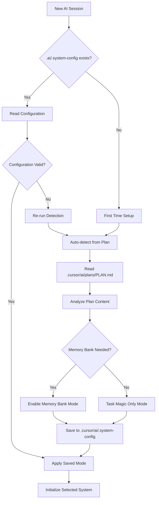
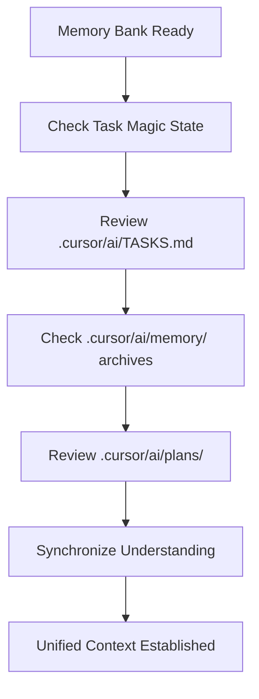
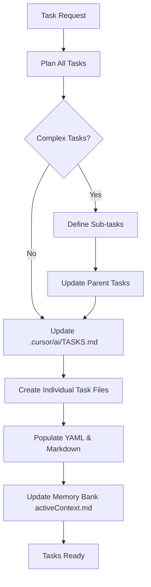
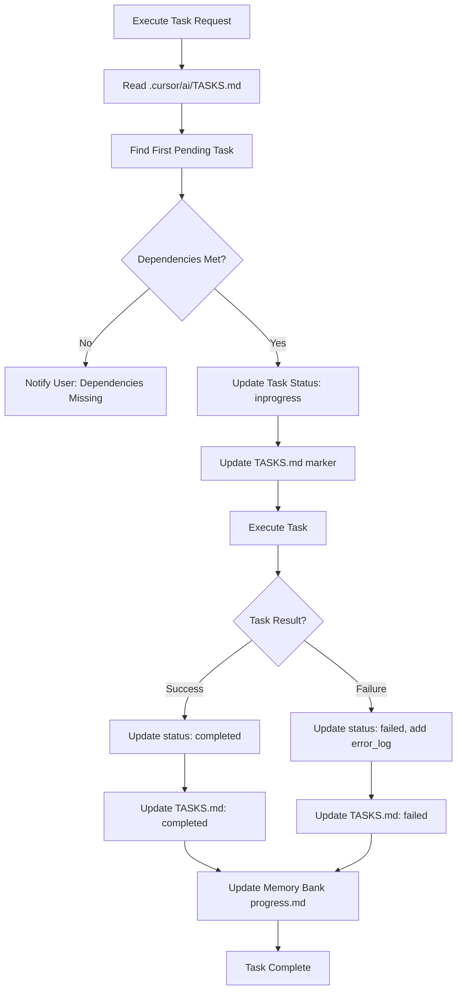
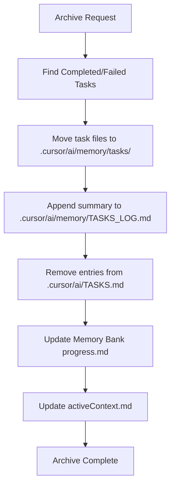
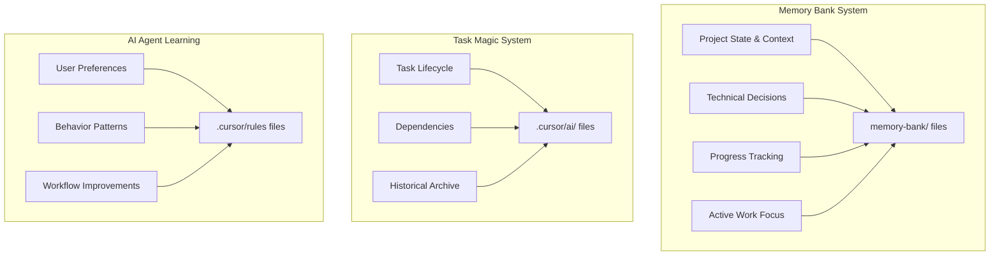

# Unified System Workflow: Memory Bank + Task Magic

This document describes the complete operational workflow for the unified Memory Bank + Task Magic system, covering AI agent session management, task operations, and continuous learning patterns.

## System Overview

## Phase 1: Session Initialization

### 1.1 Auto-Detection Protocol (MANDATORY FIRST STEP)

### 1.2 Memory Bank Initialization (When Enabled)

**Required Actions:**
1. **Read `memory-bank/projectbrief.md`** - Foundation understanding
2. **Read `memory-bank/productContext.md`** - Product goals and problems
3. **Read `memory-bank/systemPatterns.md`** - Architecture and patterns  
4. **Read `memory-bank/techContext.md`** - Technical environment
5. **Read `memory-bank/activeContext.md`** - Current work focus
6. **Read `memory-bank/progress.md`** - Current status and progress

### 1.3 Task Magic Integration (Always Active)

## Phase 2: Operation Modes

### 2.1 Plan Mode Workflow

### 2.2 Act Mode Workflow

## Phase 3: Task Magic Operations

### 3.1 Task Creation and Management

### 3.2 Task Execution Workflow

### 3.3 Task Archival Workflow

## Phase 4: Memory Bank Update Workflows

### 4.1 Automatic Update Triggers

### 4.2 Manual Memory Bank Update Process

## Phase 5: Project Intelligence & Learning

### 5.1 Pattern Discovery and Learning

### 5.2 Continuous Improvement Cycle

## Phase 6: Error Handling and Recovery

### 6.1 System State Recovery

### 6.2 Data Consistency Checks

## System Responsibility Matrix

### Clear Separation of Concerns

### Update Responsibility Rules

| System | Updates | Never Updates |
|--------|---------|---------------|
| **Memory Bank** | Project context, progress, technical decisions | .cursor/rules, task files |
| **Task Magic** | Task status, dependencies, archives | Memory Bank files, .cursor/rules |
| **AI Agent** | .cursor/rules based on experience | Memory Bank content, task details |

### Data Flow Boundaries

## Key Operational Principles

### 1. Memory-First Approach
- **Always read Memory Bank files first** at session start
- **Memory Bank drives all operations** with Task Magic providing support
- **Context preservation** is critical for effective AI operation

### 2. Unified Command Processing
- **Single entry point** through Memory Bank system
- **Automatic synchronization** between systems
- **Consistent state** maintained across all operations

### 3. Continuous Learning
- **Pattern recognition** and documentation in .cursor/rules
- **Project intelligence** accumulation over time
- **Adaptive behavior** based on learned patterns

### 4. Quality Assurance
- **Mandatory file reviews** for critical operations
- **Consistency checks** between systems
- **Error recovery** mechanisms built-in

This unified workflow ensures reliable, consistent, and intelligent AI agent operation with persistent memory and continuous improvement capabilities. 