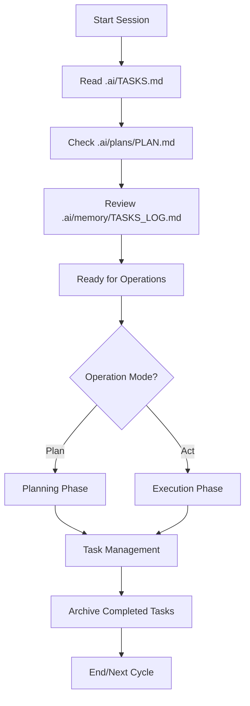

# AI Agent Rule System

This directory contains the rule files that govern AI agent behavior for the Task Management System project.

## Rule System Architecture

```mermaid
graph TD
    subgraph "Task Magic System"
        TM[Task Magic Core]
        TM_Active[Active Management (.ai/tasks/)]
        TM_Plans[Planning System (.ai/plans/)]
        TM_History[Historical Archives (.ai/memory/)]
        
        TM --> TM_Active
        TM --> TM_Plans
        TM --> TM_History
    end
    
    subgraph "Rule Files"
        TM_Rules[.task-magic/]
    end
    
    subgraph "Task Magic Rules"
        TM_Index[_index.mdc]
        TM_Tasks[tasks.mdc]
        TM_Plans_Rule[plans.mdc]
        TM_Memory[memory.mdc]
        TM_Expand[expand.mdc]
        TM_Implementation[task-implementation.mdc]
        TM_Workflow[workflow.md]
    end
    
    TM --> TM_Rules
    
    TM_Rules --> TM_Index
    TM_Rules --> TM_Tasks
    TM_Rules --> TM_Plans_Rule
    TM_Rules --> TM_Memory
    TM_Rules --> TM_Expand
    TM_Rules --> TM_Implementation
    TM_Rules --> TM_Workflow
```

## File Structure

```
.cursor/rules/
├── README.md                    # This overview file
└── .task-magic/                # Task Magic system rules
    ├── _index.mdc              # Task Magic overview
    ├── tasks.mdc               # Task management rules
    ├── plans.mdc               # Planning system rules
    ├── memory.mdc              # Historical archival rules
    ├── expand.mdc              # Task expansion rules
    ├── task-implementation.mdc # Implementation rules
    └── workflow.md             # Task Magic workflow documentation
```

## System Overview

### Task Magic System (`.task-magic/`)
- **Primary Purpose**: File-based project management and task execution framework
- **Key Components**: 
  - Active task management in `.ai/tasks/`
  - Planning system in `.ai/plans/`
  - Historical archives in `.ai/memory/`
  - Master checklist in `.ai/TASKS.md`
- **Entry Point**: `_index.mdc`
- **Core Philosophy**: File-based persistence for task lifecycle management

## Usage Patterns

### For AI Agents

#### Session Initialization
1. **Read Task Magic Overview**: Review `.task-magic/_index.mdc` for system understanding
2. **Check Current State**: Review `.ai/TASKS.md` for active tasks
3. **Review Plans**: Check `.ai/plans/PLAN.md` for project context
4. **Check History**: Review `.ai/memory/TASKS_LOG.md` for historical context
5. **Ready for Work**: Task Magic system ready with full context

#### Operation Modes
- **Plan Mode**: Planning workflows for creating PRDs and task breakdowns
- **Act Mode**: Execution workflows for implementing tasks and code
- **Task Management**: Create, execute, and archive tasks through structured workflows

### For Users

#### Rule Access
- Use `@rule-name` syntax to reference specific rules
- Rules are automatically applied based on trigger keywords
- Manual rule invocation available through explicit requests

#### System Health
- Task system maintains consistency through file-based operations
- Historical archives provide context for decision making
- Error handling and recovery built-in

## Key Features

### Task Magic System
- **File-Based Management**: All tasks stored as Markdown files with YAML frontmatter
- **Master Checklist**: Synchronized view in `.ai/TASKS.md`
- **Dependency Tracking**: Full dependency resolution and blocking logic
- **Historical Archives**: Completed tasks moved to `.ai/memory/` for future reference
- **Plan/Act Modes**: Clear separation between planning and execution phases

### Operational Excellence
- **Task Lifecycle**: Complete management from creation to archival
- **Real Timestamps**: Mandatory use of actual timestamps for all operations
- **File Synchronization**: Automatic consistency between task files and master checklist
- **Archive Management**: Systematic archival of completed work

### Simplified Project Workflow

## 1. Session Initialization
- AI Agent reads `.ai/TASKS.md` and `.ai/plans/PLAN.md` to establish project context
- Reviews historical context from `.ai/memory/TASKS_LOG.md`

## 2. Planning Phase (Plan Mode)
- Generate/update PRD (Product Requirements Documents) and planning documents, stored in `.ai/plans/`
- Only create Markdown documents, no code generation
- Use Mermaid diagrams for architecture visualization when needed

## 3. Task Management (Task Magic)
- All development tasks exist as Markdown files in `.ai/tasks/`
- Task status synchronized in `.ai/TASKS.md`
- Completed or failed tasks are automatically archived to `.ai/memory/tasks/` and logged in `TASKS_LOG.md`

## 4. Execution Phase (Act Mode)
- Generate/modify code, install packages, run tests based on planning and task content
- Update task status and sync with master checklist
- Record implementation details and test results

## 5. History & Learning
- Historical tasks and decisions are automatically archived for future reference
- Project learning and patterns can be recorded in `.cursor/rules/` for continuous team knowledge optimization

---

## Workflow Diagram



---

## Key Components

- **Task Magic**: File-based task management ensuring every task is traceable and properly archived
- **Plan/Act Mode**: Clear separation between planning and execution phases  
- **File-Based Persistence**: All project state stored in organized file structures
- **Auto Sync**: Task status automatically synchronized across all files to reduce human errors

---
