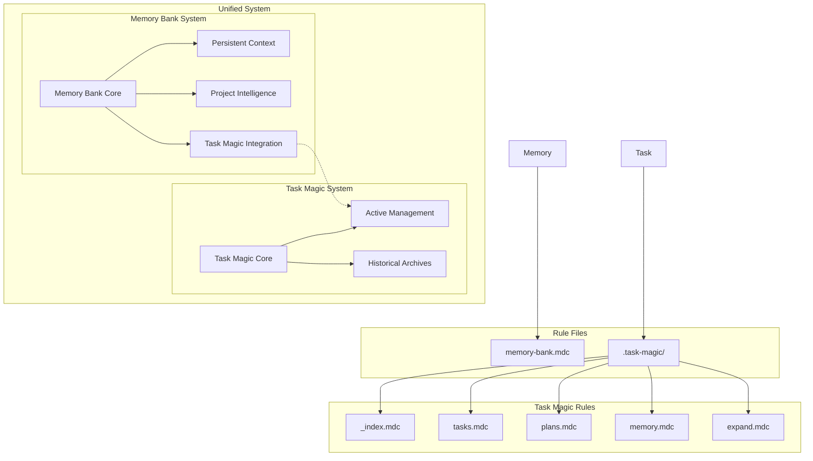

# AI Agent Rule System

This directory contains the rule files that govern AI agent behavior for the Task Management System project.

## Rule System Architecture



## File Structure

```
.cursor/rules/
├── README.md                    # This overview file
├── memory-bank.mdc             # Enhanced Memory Bank system with integration
└── .task-magic/               # Task Magic system rules
    ├── _index.mdc             # Task Magic overview
    ├── tasks.mdc              # Task management rules
    ├── plans.mdc              # Planning system rules
    ├── memory.mdc             # Historical archival rules
    ├── expand.mdc             # Task expansion rules
    └── workflow.md            # Workflow documentation
```

## System Overview

### 1. Task Magic System (`.task-magic/`)
- **Primary Purpose**: Operational task and plan management
- **Key Components**: Active tasks, plans, historical archives
- **File Location**: `.ai/` directory
- **Entry Point**: `_index.mdc`

### 2. Memory Bank System (`memory-bank.mdc`)
- **Primary Purpose**: Persistent context across AI sessions with built-in Task Magic integration
- **Key Components**: 
  - File hierarchy with clear dependencies
  - Project intelligence and pattern learning
  - Automatic synchronization with Task Magic
  - Plan/Act mode workflows
- **File Location**: `memory-bank/` directory
- **Integration**: Seamlessly integrated with Task Magic through unified workflows

## Usage Patterns

### For AI Agents

#### Session Initialization
1. **MANDATORY**: Read `memory-bank.mdc` first - establishes all context and integration patterns
2. **Read Task Magic Overview**: Review `.task-magic/_index.mdc` for operational details  
3. **Apply Context**: Load actual project files as per Memory Bank hierarchy
4. **Ready for Work**: Unified system ready with full context

#### Operation Modes
- **Memory Bank Mode**: Primary mode using `memory-bank.mdc` with integrated workflows
- **Task Magic Mode**: Specialized operations using `.task-magic/` rules
- **Plan Mode**: Planning workflows through Memory Bank system
- **Act Mode**: Execution workflows with automatic synchronization

### For Users

#### Rule Access
- Use `@rule-name` syntax to reference specific rules
- Rules are automatically applied based on trigger keywords
- Manual rule invocation available through explicit requests

#### System Health
- All systems work together seamlessly
- Integration layer handles consistency automatically
- Error handling and recovery built-in

## Key Features

### Enhanced Memory Bank System
- **Mandatory Memory**: AI agents MUST read all memory bank files at session start
- **File Hierarchy**: Clear dependencies between projectbrief → context files → activeContext → progress
- **Project Intelligence**: Learning journal in .cursor/rules captures patterns and preferences
- **Plan/Act Modes**: Structured workflows for planning and execution

### Operational Excellence
- **Task Management**: Complete lifecycle from creation to archival through Task Magic
- **Memory Integration**: Automatic synchronization between Memory Bank and Task Magic
- **Historical Context**: Learn from past implementations stored in .ai/memory/
- **Pattern Recognition**: Continuous learning and application of project-specific patterns

### Unified System Benefits
- **Single Rule Entry**: Memory Bank rule contains all integration logic
- **Automatic Sync**: Systems stay consistent without separate integration layer
- **Context-First**: Memory Bank drives all operations with Task Magic providing operational support
- **Simplified Architecture**: Two-system approach (Memory Bank + Task Magic) with built-in coordination

## Advanced Usage

### Custom Workflows
The rule system supports custom workflows through:
- Trigger keyword customization
- Integration pattern extension
- Custom synchronization rules

### System Extension
New capabilities can be added by:
- Creating additional `.mdc` rule files
- Extending integration patterns
- Adding new trigger mechanisms

### Performance Optimization
The system includes:
- Lazy loading of historical data
- Efficient caching strategies
- Optimized file access patterns

## Best Practices

### For Rule Development
1. **Use Mermaid Diagrams**: Visual workflows improve understanding
2. **Clear Trigger Patterns**: Define explicit activation conditions
3. **Integration Awareness**: Consider cross-system impacts
4. **Error Handling**: Include comprehensive error scenarios

### For System Operation
1. **Regular Synchronization**: Keep systems aligned
2. **Context Maintenance**: Update Memory Bank regularly
3. **Historical Review**: Leverage past work for better decisions
4. **Performance Monitoring**: Watch for system health issues

This enhanced rule system provides a powerful framework for AI agent operation, with Memory Bank as the primary system providing persistent context, project intelligence, and integrated Task Magic coordination. The unified approach ensures consistent, context-aware AI behavior with continuous learning capabilities. 