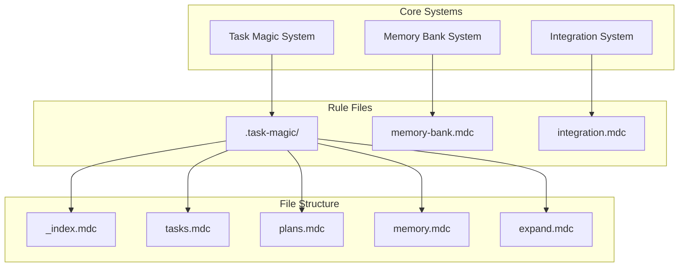

# AI Agent Rule System

This directory contains the rule files that govern AI agent behavior for the Task Management System project.

## Rule System Architecture



## File Structure

```
.cursor/rules/
├── README.md                    # This overview file
├── memory-bank.mdc             # Memory Bank system rules
├── integration.mdc             # Integration between systems
└── .task-magic/               # Task Magic system rules
    ├── _index.mdc             # Task Magic overview
    ├── tasks.mdc              # Task management rules
    ├── plans.mdc              # Planning system rules
    ├── memory.mdc             # Historical archival rules
    ├── expand.mdc             # Task expansion rules
    └── workflow.md            # Workflow documentation
```

## System Overview

### 1. Task Magic System (`.task-magic/`)
- **Primary Purpose**: Operational task and plan management
- **Key Components**: Active tasks, plans, historical archives
- **File Location**: `.ai/` directory
- **Entry Point**: `_index.mdc`

### 2. Memory Bank System (`memory-bank.mdc`)
- **Primary Purpose**: Persistent context across AI sessions
- **Key Components**: Project context, patterns, progress tracking
- **File Location**: `memory-bank/` directory
- **Integration**: Syncs with Task Magic system

### 3. Integration System (`integration.mdc`)
- **Primary Purpose**: Coordinate between Memory Bank and Task Magic
- **Key Features**: Unified commands, auto-sync, conflict resolution
- **Operation**: Cross-system synchronization and consistency

## Usage Patterns

### For AI Agents

#### Session Initialization
1. **Read Task Magic Overview**: Start with `.task-magic/_index.mdc`
2. **Read Memory Bank Rules**: Review `memory-bank.mdc`
3. **Understand Integration**: Check `integration.mdc`
4. **Apply Context**: Load actual project files as per rules

#### Operation Modes
- **Task Magic Mode**: Use `.task-magic/` rules for task operations
- **Memory Bank Mode**: Use `memory-bank.mdc` for context operations
- **Integration Mode**: Use `integration.mdc` for cross-system operations

### For Users

#### Rule Access
- Use `@rule-name` syntax to reference specific rules
- Rules are automatically applied based on trigger keywords
- Manual rule invocation available through explicit requests

#### System Health
- All systems work together seamlessly
- Integration layer handles consistency automatically
- Error handling and recovery built-in

## Key Features

### Persistent Memory
- **Context Preservation**: AI agents maintain project understanding across sessions
- **Pattern Learning**: System learns and applies project-specific patterns
- **Decision History**: Track and learn from past decisions

### Operational Excellence
- **Task Management**: Complete lifecycle from creation to archival
- **Plan Management**: Structured approach to feature development
- **Historical Context**: Learn from past implementations

### Integration Benefits
- **Unified Interface**: Single command set for all operations
- **Auto-Synchronization**: Systems stay consistent automatically
- **Conflict Resolution**: Intelligent handling of data conflicts

## Advanced Usage

### Custom Workflows
The rule system supports custom workflows through:
- Trigger keyword customization
- Integration pattern extension
- Custom synchronization rules

### System Extension
New capabilities can be added by:
- Creating additional `.mdc` rule files
- Extending integration patterns
- Adding new trigger mechanisms

### Performance Optimization
The system includes:
- Lazy loading of historical data
- Efficient caching strategies
- Optimized file access patterns

## Best Practices

### For Rule Development
1. **Use Mermaid Diagrams**: Visual workflows improve understanding
2. **Clear Trigger Patterns**: Define explicit activation conditions
3. **Integration Awareness**: Consider cross-system impacts
4. **Error Handling**: Include comprehensive error scenarios

### For System Operation
1. **Regular Synchronization**: Keep systems aligned
2. **Context Maintenance**: Update Memory Bank regularly
3. **Historical Review**: Leverage past work for better decisions
4. **Performance Monitoring**: Watch for system health issues

This rule system provides a comprehensive framework for AI agent operation, combining the operational excellence of Task Magic with the persistent memory capabilities of Memory Bank, all coordinated through intelligent integration. 