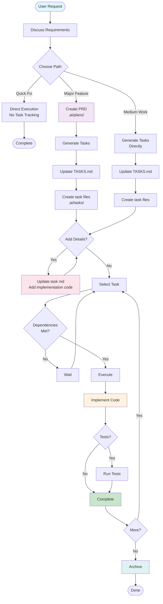

# Task Magic System - AI Task Management Framework

A file-based AI task management system that helps you effectively plan, execute, and track project development tasks through AI assistants.

## 🚀 Quick Start

### What is Task Magic?
Task Magic enables AI assistants to manage your project workflow using plain Markdown files to track all tasks, providing clear visibility for both you and the AI.

### Core Features
- 📝 **File-Driven**: All tasks and plans are readable Markdown files
- 🤖 **AI-Native**: Designed for AI assistants with automatic state synchronization
- 📊 **Full Tracking**: Complete lifecycle from planning to execution to archival
- 🔄 **Historical Memory**: Completed tasks auto-archive for project context

## 📁 System Structure
```
project-root/
├── .ai/                      # AI task management
│   ├── plans/               # Project planning (PRDs)
│   ├── tasks/              # Active tasks
│   ├── memory/             # Historical archives
│   └── TASKS.md           # Master task checklist
└── .cursor/rules/          # AI behavior rules
```

## 🎯 How to Use

### 1. Initialize Project
```
"Create a project plan for [project name]"
```

### 2. Generate Tasks
```
"Create tasks from the plan"
```

### 3. Prepare Tasks (Optional)
```
"Update task 3 md"  # Add implementation details before execution
```

### 4. Execute Tasks
```
"Start next task"     # AI finds first pending task
"Execute task 3"      # Execute specific task
"Continue work"       # Continue with next task
```

### 5. Manage Tasks
```
"Complete task 3"     # Mark as complete
"Archive tasks"       # Move completed to memory
```

## 📊 Task Status Icons

**Task Status:**
- `[ ]` Pending
- `[-]` In Progress  
- `[x]` Completed
- `[!]` Failed

**Implementation Status** (when using `update task md`):
- `[📝]` Has implementation details
- `[⚡]` Code ready to apply
- `[🔧]` Partially implemented
- `[✅]` Fully implemented

## 🔄 Workflow Patterns



### Which Workflow to Use?
- **Quick Fix** → Direct execution (no tasks)
- **Major Feature** → Full planning with PRD
- **Medium Work** → Generate tasks directly

## 📝 Task File Example

```yaml
    ---
    id: 3
    title: 'Implement User Login'
    status: pending
    implementation_status: not_implemented  # Changes when adding details
    priority: high
    dependencies: [1, 2]
    created_at: "2025-01-15T10:00:00Z"
    ---

    ## Description
    Allow users to log in with email/password

    ## Details
    - Validate credentials
    - Create session token
    - Handle errors

    ## Test Strategy
    Test with valid/invalid credentials

    ## Implementation Details
    (Added with "update task 3 md")
    ```python
    def authenticate_user(username, password):
        # Copy-paste ready code
        pass
    ```

    ### Files to Modify
    1. `src/auth/login.py` - Add authenticate function
```


## 💡 Best Practices

1. **Plan First**: Create PRDs for complex features
2. **Add Details**: Use `update task md` to prepare code before execution
3. **Test Always**: Include test strategies in tasks
4. **Archive Regularly**: Keep active tasks clean

## 🎓 Quick Commands

| Command | Action |
|---------|--------|
| `Show tasks` | Display task list |
| `Create plan for {feature}` | Generate PRD |
| `Create tasks from plan` | Generate tasks from PRD |
| `Update task {id} md` | Add implementation code |
| `Start next task` | Begin first pending task |
| `Execute task {id}` | Work on specific task |
| `Complete task {id}` | Mark as complete |
| `Archive tasks` | Move completed to memory |

## 🔧 Advanced Features

### Complex Tasks
```
"Check if task 5 needs expansion"  # AI suggests splitting large tasks
```

### Query History
```
"Show completed tasks"             # View archived work
"How was {feature} implemented?"   # Search past implementations
```

### Batch Operations
```
"Create all database tasks"        # Multiple task creation
"Archive this week's tasks"        # Bulk archival
```

## 🚨 Important Notes

- System uses **real UTC timestamps**, not simulated
- **Plan Mode**: Only creates documentation, no code
- **Act Mode**: Actual implementation and code execution
- All state persists in files, survives restarts

## 📚 System Rules

Detailed rules are in `.cursor/rules/.task-magic/`:
- `_index.mdc` - System overview
- `tasks.mdc` - Task management
- `plans.mdc` - Planning system
- `memory.mdc` - Historical archives
- `expand.mdc` - Task splitting
- `task-implementation.mdc` - Implementation details

---

*Task Magic - Your AI-Powered Project Management Partner* 🎯
