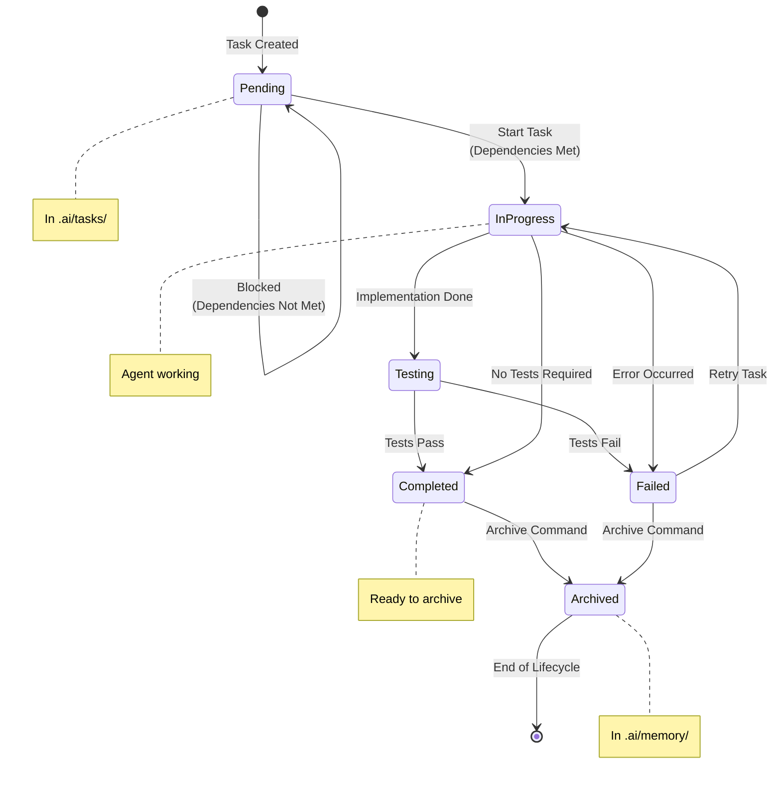

# Task Magic System - AI Task Management Framework

A file-based AI task management system that helps you effectively plan, execute, and track project development tasks through AI assistants.

## 🚀 Quick Start

### What is Task Magic?

Task Magic is a system that enables AI assistants to understand and manage your project development workflow. It uses plain text files (Markdown) to track all tasks, providing clear visibility for both you and the AI on project progress.

### Core Features

- 📝 **File-Driven**: All tasks and plans are readable Markdown files
- 🤖 **AI-Native**: Designed for AI assistants with automatic state synchronization
- 📊 **Full Tracking**: Complete lifecycle from planning to execution to archival
- 🔄 **Historical Memory**: Completed tasks auto-archive for project context

## 📁 System Structure

```
project-root/
├── .ai/                      # AI task management main directory
│   ├── plans/               # Project planning documents (PRDs)
│   │   ├── PLAN.md         # Required: Overall project plan
│   │   └── features/       # Feature-specific plans
│   │       └── {feature}-plan.md
│   ├── tasks/              # All active tasks
│   │   └── task{id}_{name}.md
│   ├── memory/             # Historical archives
│   │   ├── tasks/         # Completed/failed tasks
│   │   ├── plans/         # Archived plans
│   │   ├── TASKS_LOG.md   # Task archive log
│   │   └── PLANS_LOG.md   # Plan archive log
│   └── TASKS.md           # Master task checklist (must read!)
└── .cursor/rules/          # AI behavior rules
    └── .task-magic/       # Task Magic system rules
```

## 🎯 How to Use

### 1. Initialize Project

When starting a new project, ask the AI assistant to create a project plan:

```
"Please create a project plan for [project name]"
```

The AI will automatically:
- Create `.ai/plans/PLAN.md` overall plan
- Create `.ai/plans/features/{feature}-plan.md` for specific features if needed

### 2. Generate Tasks from Plans

Once you have plans, let the AI break them down into executable tasks:

```
"Create development tasks from the plan"
or
"Create tasks for [feature name]"
```

The AI will:
- Analyze planning documents
- Create task list in `.ai/TASKS.md`
- Create detailed files in `.ai/tasks/` for each task

### 3. Prepare Tasks with Implementation Details

Before executing tasks, you can optionally add detailed implementation code:

#### Update Task with Implementation Details
```
"Update task 3 md"
or
"Add implementation details to task 3"
```

This command adds actual implementation code to the task file, transforming it from a description into an executable guide with:
- Copy-paste ready code blocks
- Exact file modification instructions
- Build/test commands
- Implementation status tracking

#### Implementation Status Icons
When using `update task {id} md`, tasks show implementation progress:
- `[📝]` = Detailed (has implementation details)
- `[⚡]` = Code Ready (finalized code ready to apply)
- `[🔧]` = Partially Implemented (some code applied)
- `[✅]` = Fully Implemented (all code applied and tested)

### 4. Execute Tasks

#### View Task Status
```
"Show all tasks"
or
"List tasks"
```

#### Start Working
```
"Start next task"          # AI automatically finds first pending task
"Execute task 3"          # Execute specific numbered task
"Continue work"           # Continue with next executable task
```

#### Task Status Icons
In `.ai/TASKS.md`:
- `[ ]` = Pending
- `[-]` = In Progress
- `[x]` = Completed
- `[!]` = Failed

### 5. Manage Tasks

#### Complete Task
```
"Complete task 3"
```

#### Mark Task as Failed
```
"Task 3 failed due to [error description]"
```

#### View Task Details
```
"Show details for task 3"
```

#### Archive Completed Tasks
```
"Archive completed tasks"
or
"Clean up finished tasks"
```

### 6. Handle Complex Tasks

When a task is too large, AI will suggest splitting:

```
"Check if task 5 needs to be expanded"
```

If needed, AI will suggest subtasks:
- task5.1_database_setup.md
- task5.2_api_implementation.md
- task5.3_ui_components.md

## 🔄 Workflow

### Plan Mode vs Act Mode

Task Magic distinguishes between two work modes:

#### 📋 Plan Mode
- Create and update PRD documents
- Design system architecture
- Break down tasks
- **Only generates documentation, no code**

Trigger keywords:
- "Create plan", "Update PRD", "Design architecture"

#### ⚡ Act Mode
- Implement code
- Install packages
- Run tests
- **Actual development work**

Trigger keywords:
- "Execute task", "Start work", "Implement feature"

### Complete Workflow Map

The Task Magic system supports multiple workflow patterns. This comprehensive diagram shows all possible paths and branches:

```mermaid
flowchart TD
    Start([User Request]) --> Discuss[Discuss Requirements]
    
    Discuss --> Path1{Choose Path}
    
    %% Workflow 1: Direct Execution (No Tasks)
    Path1 -->|"Workflow 1:<br/>Simple/Quick"| DirectExec[Direct Execution<br/>No Task Tracking]
    DirectExec --> Done1([Complete])
    
    %% Workflow 2: Full Planning with Tasks
    Path1 -->|"Workflow 2:<br/>Formal Planning"| CreatePRD[Create/Update PRD<br/>.ai/plans/]
    CreatePRD --> GenTasksFromPRD[Generate Tasks<br/>from PRD]
    GenTasksFromPRD --> UpdateTasksMD1[Update TASKS.md]
    UpdateTasksMD1 --> CreateTaskFiles1["Create task files<br/>(task1_name.md)<br/>.ai/tasks/"]
    
    %% Workflow 3: Flexible Task Generation
    Path1 -->|"Workflow 3:<br/>Task First"| GenTasksDirect[Generate Tasks<br/>Directly]
    GenTasksDirect --> UpdateTasksMD2[Update TASKS.md]
    UpdateTasksMD2 --> CreateTaskFiles2["Create task files<br/>(task1_name.md)"]
    
    %% Optional Task Updates (for both workflow 2 and 3)
    CreateTaskFiles1 --> OptionalUpdate{Update Tasks?}
    CreateTaskFiles2 --> OptionalUpdate
    
    OptionalUpdate -->|"Yes:<br/>Add Details"| UpdateTaskMD["Update task files<br/>using 'update task {id} md'<br/>- Add implementation code<br/>- Specify files to modify<br/>- Refine test strategy"]
    UpdateTaskMD --> OptionalUpdate
    
    OptionalUpdate -->|"No:<br/>Ready"| SelectTask[Select Task to Execute]
    
    %% Task Execution Flow
    SelectTask --> CheckDeps{Dependencies<br/>Met?}
    CheckDeps -->|No| WaitDeps[Complete<br/>Dependencies First]
    WaitDeps --> SelectTask
    
    CheckDeps -->|Yes| StartTask[Start Task<br/>Status: inprogress]
    StartTask --> Implementation[Execute Implementation<br/>- Write Code<br/>- Install Packages<br/>- Create Files]
    
    Implementation --> TestCheck{Has Test<br/>Strategy?}
    TestCheck -->|No| CompleteTask
    TestCheck -->|Yes| AskTest{User: Run Tests?}
    AskTest -->|Yes| RunTests[Execute Tests]
    AskTest -->|Skip| CompleteTask
    
    RunTests --> TestResult{Tests Pass?}
    TestResult -->|Yes| CompleteTask[Mark Complete<br/>Status: completed]
    TestResult -->|No| FailTask[Mark Failed<br/>Status: failed]
    
    CompleteTask --> NextTask{More Tasks?}
    FailTask --> RetryChoice{Retry?}
    RetryChoice -->|Yes| StartTask
    RetryChoice -->|No| NextTask
    
    NextTask -->|Yes| SelectTask
    NextTask -->|No| ArchiveTasks[Archive to .ai/memory/<br/>Update TASKS_LOG.md]
    
    ArchiveTasks --> Done2([Project Complete])
    
    %% Styling
    style Start fill:#e1f5fe
    style Discuss fill:#f5f5f5
    style CreatePRD fill:#f3e5f5
    style GenTasksFromPRD fill:#f3e5f5
    style GenTasksDirect fill:#f3e5f5
    style UpdateTaskMD fill:#fce4ec
    style DirectExec fill:#fff9c4
    style Implementation fill:#fff3e0
    style CompleteTask fill:#c8e6c9
    style FailTask fill:#ffcdd2
    style Done1 fill:#c8e6c9
    style Done2 fill:#c8e6c9
    style ArchiveTasks fill:#e0f2f1
    style RunTests fill:#ffecb3
    
    %% Add workflow labels
    DirectExec -.->|No Tasks Created| Done1
    CreatePRD -.->|PRD in .ai/plans/| GenTasksFromPRD
    GenTasksDirect -.->|Quick Start| UpdateTasksMD2
```



### Workflow Branches Explained

The diagram above shows three main workflow branches:

#### **🚀 Workflow 1: Direct Execution**
- **Path**: Discuss → Direct Execute → Done
- **Files Created**: None
- **Use Cases**: Quick fixes, simple changes, prototyping
- **Example**: "Fix that typo in the header"

#### **📋 Workflow 2: Plan → Generate Tasks → Execute**
- **Path**: Discuss → Create PRD → Generate Tasks → (Optional: Update Tasks) → Execute → Archive
- **Files Created**: 
  - `.ai/plans/PLAN.md` or `.ai/plans/features/{feature}-plan.md`
  - `.ai/tasks/task{id}_{name}.md`
  - `.ai/TASKS.md` (updated)
  - `.ai/memory/` (archived tasks)
- **Use Cases**: Major features, team projects, complex implementations
- **Example**: "Build user authentication system"

#### **⚡ Workflow 3: Quick Task Generation → Execute**
- **Path**: Discuss → Generate Tasks → (Optional: Update Tasks) → Execute → Archive
- **Files Created**:
  - `.ai/tasks/task{id}_{name}.md`
  - `.ai/TASKS.md` (updated)
  - `.ai/memory/` (archived tasks)
- **Use Cases**: Medium complexity, iterative development, when you know what to build
- **Example**: "Create CRUD API for products"

### Key Decision Points

| Decision Point | Question to Ask | Options |
|---------------|-----------------|---------|
| **Path Selection** | How complex is this request? | Simple → Workflow 1<br/>Complex → Workflow 2<br/>Medium → Workflow 3 |
| **Update Tasks?** | Do tasks need more details? | Yes → Add implementation details<br/>No → Start execution |
| **Run Tests?** | Does task have test strategy? | Yes → Execute tests<br/>No/Skip → Mark complete |
| **Retry Failed?** | Should we retry failed task? | Yes → Back to execution<br/>No → Move to next |
| **Archive?** | Are tasks complete/failed? | Yes → Move to memory<br/>No → Keep in tasks |

### Workflow Selection Guide

| Scenario | Recommended Workflow | Why |
|----------|---------------------|-----|
| Bug fixes | Workflow 1 (Direct) | Quick turnaround, no planning needed |
| New feature | Workflow 2 (Full) | Needs planning, multiple tasks |
| Prototype | Workflow 1 (Direct) | Speed over formality |
| Client project | Workflow 2 (Full) | Documentation and tracking important |
| Learning/exploring | Workflow 3 (Flexible) | Can adjust as you learn |
| Refactoring | Workflow 3 (Flexible) | May discover tasks as you go |

### Typical Task Lifecycle



## 📝 Task File Format

Each task is a Markdown file containing:

```yaml
---
id: 3                      # Task ID
title: 'Implement User Login'  # Task title
status: pending            # Status: pending/inprogress/completed/failed
implementation_status: not_implemented  # not_implemented/detailed/code_ready/partially_implemented/fully_implemented
priority: high             # Priority: critical/high/medium/low
feature: User Authentication  # Feature category
dependencies:              # Task dependencies
  - 1
  - 2
created_at: "2025-01-15T10:00:00Z"
implementation_detailed_at: null  # Set when implementation details added
---

## Description
Brief description of task goal

## Details
- Specific requirement 1
- Specific requirement 2
- Technical considerations

## Test Strategy
How to verify task completion

## Implementation Details
(Added when running `update task {id} md`)
```python
# Copy-paste ready code
def authenticate_user(username, password):
    # Implementation here
    pass
```

### Files to Modify
1. `src/auth/login.py` - Add authenticate_user function
2. `src/api/routes.py` - Add /login endpoint

## Agent Notes
(AI notes during execution)
```

## 🎓 Practical Examples

### Example 1: Creating a New Feature

```
User: "I need to add user authentication"

AI Response Flow:
1. Create .ai/plans/features/user-auth-plan.md
2. Update .ai/plans/PLAN.md with link
3. Ask if tasks should be generated

User: "Yes, create tasks"

AI automatically:
1. Analyzes auth requirements
2. Creates task list:
   - task1_setup_database.md
   - task2_user_model.md
   - task3_auth_api.md
   - task4_login_ui.md
3. Updates .ai/TASKS.md
```

### Example 2: Daily Development Flow

```
Morning start:
User: "Show task status"
AI: Displays TASKS.md content

User: "Start next task"
AI: Checks dependencies → Updates status → Begins implementation

User: "Done"
AI: Runs test strategy → Marks complete

End of day:
User: "Archive completed tasks"
AI: Moves files to memory/ → Updates logs
```

## 🔍 Query Historical Memory

The system automatically saves all completed work:

```
"Show previously completed tasks"
"How was [feature] implemented before?"
"Have we done similar features?"
```

AI will query:
- `.ai/memory/TASKS_LOG.md` - Task history
- `.ai/memory/PLANS_LOG.md` - Planning history
- Related archived files

## ⚙️ Advanced Features

### Task Priority Levels

- **critical** 🔴: Core project functionality, must complete immediately
- **high** 🟠: Important features or fixes
- **medium** 🟡: Standard development tasks (default)
- **low** 🟢: Deferrable improvements

### Dependency Management

Tasks can set dependencies, AI will automatically:
- Check if dependent tasks are complete
- Block unexecutable tasks
- Suggest optimal execution order

### Batch Operations

```
"Create all database-related tasks"
"Complete all test tasks"
"Archive this week's completed tasks"
```

## 🛠️ System Maintenance

### Keep Synchronized
AI automatically maintains file sync, but you can also request:
```
"Check task file sync status"
"Fix TASKS.md sync issues"
```

### Cleanup and Organization
```
"Organize task priorities"
"Clean up failed tasks"
"Renumber tasks"
```

## 💡 Best Practices

1. **Regular Review**: Check TASKS.md before starting each day
2. **Timely Archival**: Archive completed tasks promptly for clarity
3. **Clear Descriptions**: Task descriptions should be clear for AI understanding
4. **Appropriate Splitting**: Split large tasks, merge tiny ones
5. **Test First**: Every task should have a test strategy

## 🚨 Important Notes

- **Real Timestamps**: System uses real UTC time, not simulated
- **File Persistence**: All state stored in files, survives restarts
- **Plan/Act Separation**: No code during planning, implementation during execution
- **Auto Sync**: AI automatically keeps all file states consistent

## 🤝 AI Collaboration Tips

### Clear Commands
```
✅ "Execute task 3 and run tests"
✅ "Create detailed plan for shopping cart feature"
❌ "Do next" (too vague)
❌ "Continue" (unclear what to do)
```

### Provide Context
```
✅ "This task needs high priority because client is waiting"
✅ "Use React and TypeScript for frontend implementation"
```

### Regular Confirmation
```
"What's the current progress?"
"Which tasks are still pending?"
"Are all tasks for this feature complete?"
```

## 📚 Further Reading

### System Rule Documents
- `.cursor/rules/.task-magic/_index.mdc` - System overview
- `.cursor/rules/.task-magic/tasks.mdc` - Task management detailed rules
- `.cursor/rules/.task-magic/plans.mdc` - Planning system rules
- `.cursor/rules/.task-magic/memory.mdc` - Historical memory rules
- `.cursor/rules/.task-magic/expand.mdc` - Task expansion rules
- `.cursor/rules/.task-magic/workflow.md` - Detailed workflow diagram

### Technical Architecture

```mermaid
graph TD
    subgraph "Task Magic Core System"
        TM[Task Magic Engine]
        TM_Active[Active Tasks (.ai/tasks/)]
        TM_Plans[Project Plans (.ai/plans/)]
        TM_History[Historical Archives (.ai/memory/)]
        
        TM --> TM_Active
        TM --> TM_Plans
        TM --> TM_History
    end
    
    subgraph "User Interaction"
        User[User] --> Command[Commands]
        Command --> AI[AI Assistant]
        AI --> TM
    end
    
    subgraph "File System"
        Files[Markdown Files]
        YAML[YAML Frontmatter]
        Files --> YAML
    end
    
    TM --> Files
```

## 🔧 Troubleshooting

### Common Issues

**Q: AI says it can't find task files?**
A: Ensure `.ai/` directory structure exists, ask AI to "initialize task system"

**Q: Task status out of sync?**
A: Request AI to "sync task status" or "fix TASKS.md"

**Q: Want to start over?**
A: Ask AI to "archive all tasks and re-plan"

**Q: How to restore archived tasks?**
A: Request AI to "restore task [number] from memory"

### Quick Commands Reference

| Command | Action |
|---------|--------|
| `Show tasks` | Display current task list |
| `Start next task` | Begin first pending task |
| `Execute task {id}` | Work on specific task |
| `Update task {id} md` | Add implementation details/code to task |
| `Complete task {id}` | Mark task as complete |
| `Archive tasks` | Move completed tasks to memory |
| `Create plan for {feature}` | Generate PRD for feature |
| `Create tasks from plan` | Generate tasks from PRD |
| `Check task {id} complexity` | Assess if task needs splitting |

## 🎯 Getting Started Checklist

1. ✅ Ask AI to "initialize Task Magic system"
2. ✅ Create initial project plan
3. ✅ Generate tasks from plan
4. ✅ Review `.ai/TASKS.md`
5. ✅ Start executing tasks
6. ✅ Archive completed work regularly

---

*Task Magic System - Your AI-Powered Project Management Partner* 🎯
