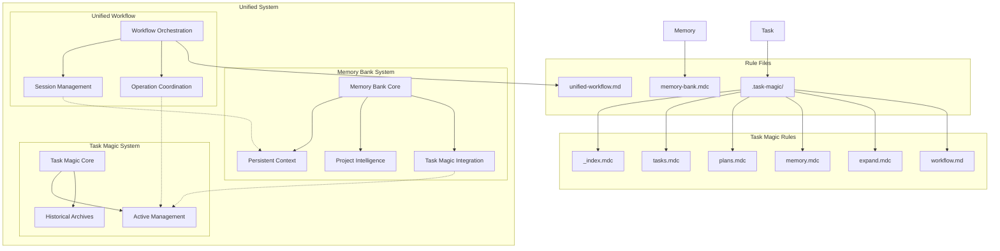
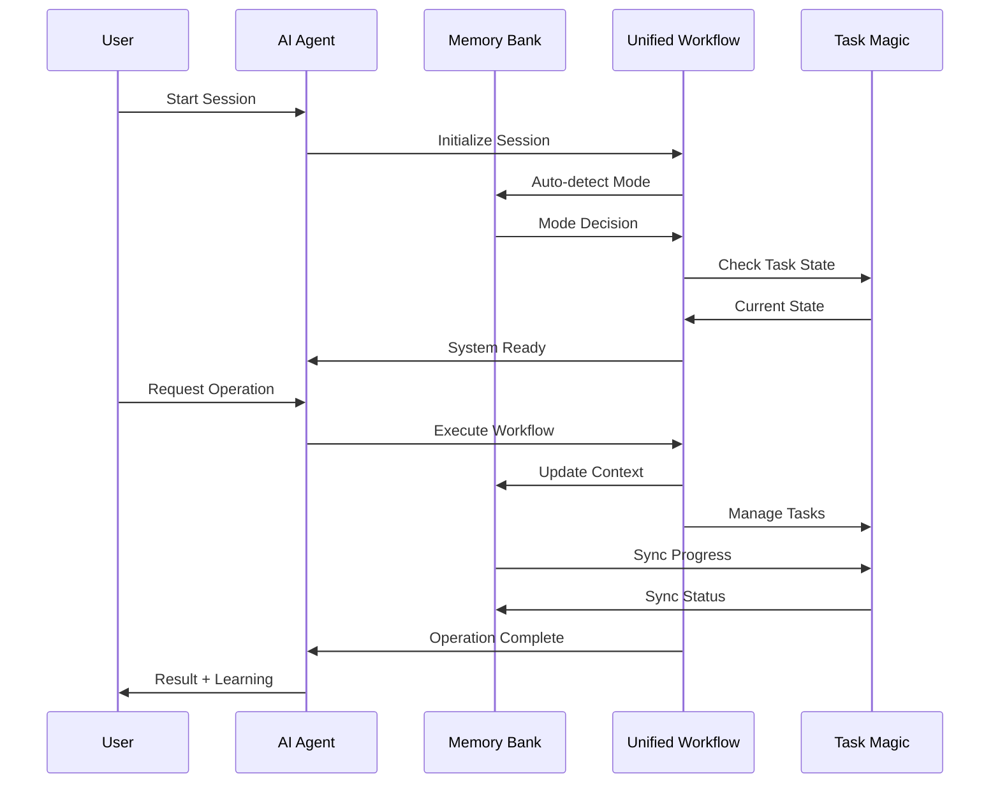
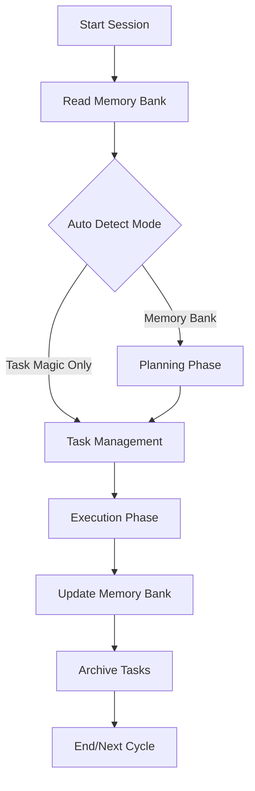

# AI Agent Rule System

This directory contains the rule files that govern AI agent behavior for the Task Management System project.

## Rule System Architecture



## File Structure

```
.cursor/rules/
├── README.md                    # This overview file
├── memory-bank.mdc             # Enhanced Memory Bank system with integration
├── unified-workflow.md         # Complete operational workflow documentation
└── .task-magic/               # Task Magic system rules
    ├── _index.mdc             # Task Magic overview
    ├── tasks.mdc              # Task management rules
    ├── plans.mdc              # Planning system rules
    ├── memory.mdc             # Historical archival rules
    ├── expand.mdc             # Task expansion rules
    └── workflow.md            # Task Magic workflow documentation
```

## System Overview

### 1. Memory Bank System (`memory-bank.mdc`)
- **Primary Purpose**: Persistent context across AI sessions with built-in Task Magic integration
- **Key Components**: 
  - File hierarchy with clear dependencies (projectbrief → context files → activeContext → progress)
  - Project intelligence and pattern learning in `.cursor/rules`
  - Automatic synchronization with Task Magic
  - Plan/Act mode workflows
- **File Location**: `memory-bank/` directory (created as needed)
- **Integration**: Seamlessly integrated with Task Magic through unified workflows

### 2. Task Magic System (`.task-magic/`)
- **Primary Purpose**: Operational task and plan management
- **Key Components**: Active tasks, plans, historical archives
- **File Location**: `.cursor/ai/` directory
- **Entry Point**: `_index.mdc`

### 3. Unified Workflow System (`unified-workflow.md`)
- **Primary Purpose**: Complete operational workflow orchestration for Memory Bank + Task Magic integration
- **Key Components**:
  - AI agent session lifecycle management
  - Auto-detection protocol for system mode selection
  - Phase-based operation workflows (Plan/Act modes)
  - Task Magic operations integration
  - Memory Bank update workflows
  - Project intelligence and continuous learning patterns
  - Error handling and recovery procedures
- **Integration**: Coordinates between Memory Bank and Task Magic systems
- **Coverage**: Session initialization, operation modes, task management, memory updates, learning cycles

## Usage Patterns

### For AI Agents

#### Session Initialization
1. **MANDATORY**: Read `memory-bank.mdc` first - establishes all context and integration patterns
2. **Read Unified Workflow**: Review `unified-workflow.md` for complete operational procedures
3. **Read Task Magic Overview**: Review `.task-magic/_index.mdc` for operational details  
4. **Apply Context**: Load actual project files as per Memory Bank hierarchy
5. **Ready for Work**: Unified system ready with full context

#### Operation Modes
- **Memory Bank Mode**: Primary mode using `memory-bank.mdc` with integrated workflows
- **Task Magic Mode**: Specialized operations using `.task-magic/` rules
- **Plan Mode**: Planning workflows through Memory Bank system
- **Act Mode**: Execution workflows with automatic synchronization
- **Unified Operations**: Complete workflow orchestration via `unified-workflow.md`

### For Users

#### Rule Access
- Use `@rule-name` syntax to reference specific rules
- Rules are automatically applied based on trigger keywords
- Manual rule invocation available through explicit requests

#### System Health
- All systems work together seamlessly
- Integration layer handles consistency automatically
- Error handling and recovery built-in

## Key Features

### Enhanced Memory Bank System
- **Mandatory Memory**: AI agents MUST read all memory bank files at session start
- **File Hierarchy**: Clear dependencies between projectbrief → context files → activeContext → progress
- **Project Intelligence**: Learning journal in `.cursor/rules` captures patterns and preferences
- **Plan/Act Modes**: Structured workflows for planning and execution
- **Auto-Detection**: Automatic determination of Memory Bank vs Task Magic only mode

### Unified Workflow Orchestration
- **Complete Lifecycle**: From session start to completion with learning integration
- **Phase Management**: Structured approach to initialization, planning, execution, and learning
- **Error Recovery**: Comprehensive error handling and system state recovery
- **Continuous Learning**: Pattern recognition and project intelligence accumulation

### Operational Excellence
- **Task Management**: Complete lifecycle from creation to archival through Task Magic
- **Memory Integration**: Automatic synchronization between Memory Bank and Task Magic
- **Historical Context**: Learn from past implementations stored in `.cursor/ai/memory/`
- **Pattern Recognition**: Continuous learning and application of project-specific patterns

### Unified System Benefits
- **Single Rule Entry**: Memory Bank rule contains all integration logic
- **Workflow Orchestration**: Unified workflow coordinates all system operations
- **Automatic Sync**: Systems stay consistent without separate integration layer
- **Context-First**: Memory Bank drives all operations with Task Magic providing operational support
- **Simplified Architecture**: Three-system approach (Memory Bank + Task Magic + Unified Workflow) with built-in coordination

## Advanced Usage

### Custom Workflows
The rule system supports custom workflows through:
- Trigger keyword customization in Memory Bank auto-detection
- Integration pattern extension via unified workflow
- Custom synchronization rules
- Phase-based operation customization

### System Extension
New capabilities can be added by:
- Creating additional `.mdc` rule files
- Extending integration patterns in unified workflow
- Adding new trigger mechanisms
- Implementing custom learning patterns

### Performance Optimization
The system includes:
- Lazy loading of historical data
- Efficient caching strategies via Memory Bank
- Optimized file access patterns
- Session-based context management

## Best Practices

### For Rule Development
1. **Use Mermaid Diagrams**: Visual workflows improve understanding
2. **Clear Trigger Patterns**: Define explicit activation conditions
3. **Integration Awareness**: Consider cross-system impacts via unified workflow
4. **Error Handling**: Include comprehensive error scenarios

### For System Operation
1. **Follow Session Lifecycle**: Use unified workflow for proper initialization
2. **Regular Synchronization**: Keep systems aligned through automatic sync
3. **Context Maintenance**: Update Memory Bank regularly
4. **Historical Review**: Leverage past work for better decisions
5. **Performance Monitoring**: Watch for system health issues
6. **Continuous Learning**: Document and apply learned patterns

## System Integration Flow



This enhanced rule system provides a powerful framework for AI agent operation, with Memory Bank as the primary system providing persistent context, Unified Workflow as the orchestration layer, and Task Magic providing operational task management. The three-system approach ensures consistent, context-aware AI behavior with continuous learning capabilities and comprehensive workflow management. 

# Simplified Project Workflow

## 1. Session Initialization
- AI Agent **must read all Memory Bank files** at startup to establish complete project context.
- Automatically determines whether to enter "Memory Bank Mode" or "Task Magic Only Mode" based on Memory Bank content and project complexity.

## 2. Planning Phase (Plan Mode)
- Generate/update PRD (Product Requirements Documents) and planning documents, stored in `.ai/plans/`.
- Only create Markdown documents, no code generation.
- Use Mermaid diagrams for architecture visualization when needed.

## 3. Task Management (Task Magic)
- All development tasks exist as Markdown files in `.ai/tasks/`.
- Task status synchronized in `.ai/TASKS.md`.
- Completed or failed tasks are automatically archived to `.ai/memory/tasks/` and logged in `TASKS_LOG.md`.

## 4. Execution Phase (Act Mode)
- Generate/modify code, install packages, run tests based on planning and task content.
- **Synchronize Memory Bank updates** (e.g., progress.md, activeContext.md) upon completion.
- Record major decisions or technical choices in systemPatterns.md or techContext.md.

## 5. History & Learning
- Historical tasks and decisions are automatically archived for future reference.
- Project learning and patterns can be recorded in `.cursor/rules/` for continuous team knowledge optimization.

---

## Workflow Diagram



---

## Key Components

- **Memory Bank**: Long-term project memory recording architecture, technology, progress, and decisions.
- **Task Magic**: Daily task management and tracking ensuring every task is traceable.
- **Plan/Act Mode**: Clear separation between planning and execution phases.
- **Auto Sync**: All states and history automatically synchronized to reduce human errors.

--- 